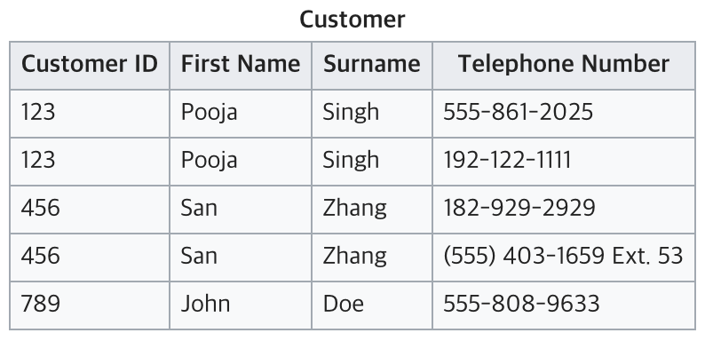
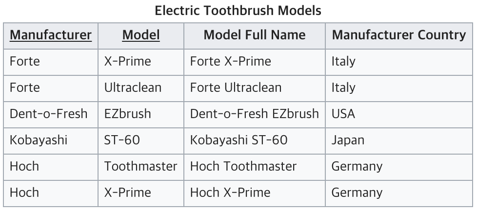
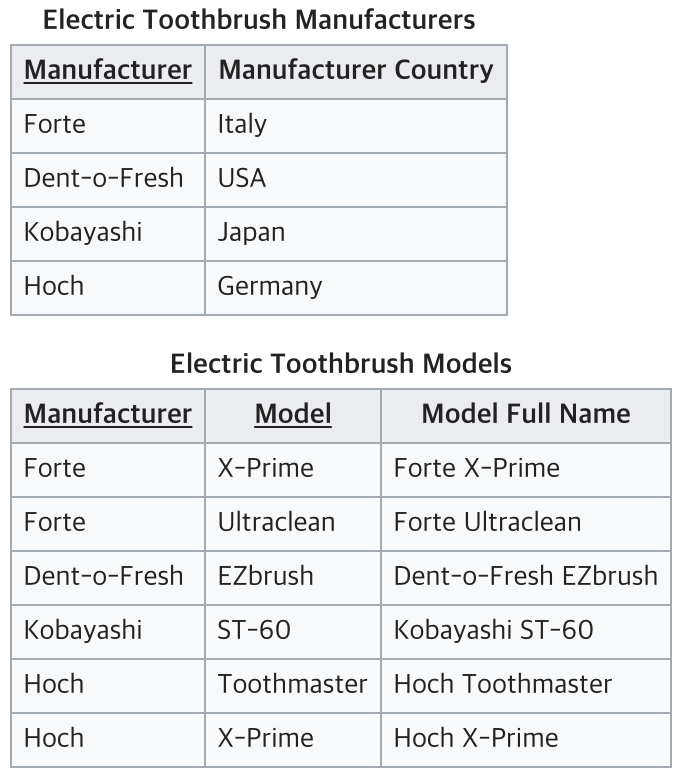
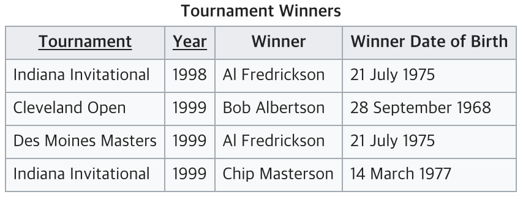
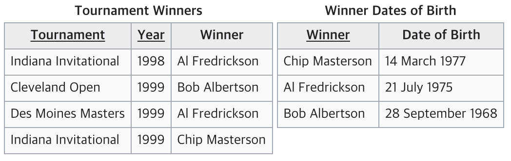

# 정규화

## 정규화란?
- RDMBS에서 중복을 최소화하기 위해 데이터를 구조화하는 작업
- 좋지 않은 거대한 릴레이션들을 좋고 작은 릴레이션들로 분해하는 작업
- 관련 있는 속성들로만 한 릴레이션을 구성하도록, 여러 릴레이션으로 분해
  - 관련 판단 기준: 함수적 종속성

### 함수적 종속성
- X에 의해 Y가 결정될 때
  - Y는 X에 함수적으로 종속
  - X는 Y를 결정
- 완전 함수 종속: `(A, B) -> C` 일 때, `A->C` 와 `B->C` 모두 성립
- 부분 함수 종속: `(A, B) -> C` 일 때, `A->C` 와 `B->C` 중 하나만 성립

## 정규화의 목적
- 테이블 간 중복된 데이터의 제거
  - 무결성 유지, DB 저장 용량의 효율적인 관리
  - `이상 (Anomaly)` 발생 방지
- 논리적이고 직관적인 테이블 구성 이해

### 이상 (Anomaly)
- 삽입 이상
  - 데이터를 삽입할 때 원하지 않는 값들도 함께 삽입되는 현상
  - 학생 테이블에 연락처만 저장하고 싶은 데, 불필요한 주소 등의 정보도 `NULL`로 하여 추가하게 됨
- 갱신 이상
  - 중복된 튜플 중 일부만 변경하여 데이터가 불일치하게 되는 현상
  - 같은 정보가 두 테이블에 위치할 경우, 한 곳만 바꿀 때
- 삭제 이상
  - 튜플을 삭제할 때 삭제하지 않고 싶은 데이터도 삭제하게 되는 현상
  - 학생 튜플 삭제 시, 마지막 연락을 위해 필요한 연락처 정보도 삭제하게 됨

## 정규화 요약
- 비정규 릴레이션
  - \+ 도메인이 원자값이 되도록 =
- 1NF
  - \+ 부분적 함수 종속 제거 =
- 2NF
  - \+ 이행적 함수 종속 제거 =
- 3NF
  - \+ 결정자이면서 후보키가 아닌 것 제거 =
- BCNF
  - \+ 다치 종속 제거 =
- 4NF
  - \+ 조인 종속성 이용 =
- 5NF

## 정규화
### 제 1 정규화 (1NF)
- 테이블 칼럼이 원자값 (하나의 값)을 갖도록 분리
- 조건
  - 모든 도메인이 원자값만으로 구성
  - 모든 속성에 반복되는 그룹이 등장 X
  - 기본키를 사용하여 관련 데이터의 각 집합을 고유하게 구분 가능

- `Customer ID`가 123, 456인 칼럼의 Telephone Number가 2개 이상의 값으로 이루어져 있으므로 1NF를 충족하지 않는다.

- Telephone Number가 여러개인 항목들을 각각의 칼럼으로 분리해주어 1NF를 충족시켜준다.

- 문제점
  - 여전히 갱신, 삽입, 삭제 이상이 발생 가능하다.

### 제 2 정규화 (2NF)
- 릴레이션이 1NF에 속함
- 테이블의 모든 칼럼이 완전 함수적 종속을 만족
    - 기본키가 복합키 (2개 이상의 키 구성)일 때, 하나의 키로만 다른 칼럼을 결정지을 수 있으면 안됨

- 기본키가 `Manufacturer`와 `Model`의 복합키인데, 컬럼 `Manufacturer Country`의 경우 `Model` 정보 없이 `Manufacturer`에 의해서 결정될 수 있다. (부분 함수 종속 존재)

- 테이블을 두개로 분리하여 부분 함수 종속을 제거해주면 2NF의 조건을 충족하게 된다.

- 문제점
  - 이행적 함수종속이 존재하기에, 3가지 이상이 모두 존재한다.
  - 이행적 함수 종속: X -> Y -> Z 관계로 X -> Z 결정

### 제 3 정규화 (3NF)
- 릴레이션이 2NF에 속함
- 기본키가 아닌 속성들은 기본키에 의존 (이행적 함수 종속 제거)

- `Winner Date of Birth`는 기본키가 아닌 `Winner`에 의해서 결정된다.
- X -> Y -> Z의 이행적 함수 종속이 존재한다.
  - X: Tournament, Year
  - Y: Winner
  - Z: Winner Date of Birth

- 테이블의 분리를 통해 이행적 함수 종속을 제거할 수 있다.

- 여전히 3가지 이상이 발생한다.
- 하지만 모든 릴레이션이 5NF에 속하는 것이 가장 좋은 것은 아니다.
  - 데이터를 사용하는 형태에 따라 가장 적합한 정규화 차수를 사용하는 것이 좋다.
  - 일반적으로 3NF나 BCNF에 속하도록 분해하여 사용하는 경우가 많다.

### 기타 정규형
**보이스-코드 정규형 (BCNF)**
- 강한 제 3 정규형
- 후보키가 아닌 속성이 다른 속성을 결정하지 않도록 분해
  - 즉, 모든 결정자는 후보키가 된다.

**제 4 정규형**
- 릴레이션이 BCNF를 만족
- 다치 종속을 제거
  - X, Y, Z 3개의 속성을 가질 때, (X, Z)에 대응되는 Y가 X에만 종속되고 Z에는 독립
  - X: 담당과목, Y: 교강사, Z: 강의실

**제 5 정규형**
- 릴레이션이 4NF를 만족
- 후보키를 통해서만 조인 종속이 만족
  - 조인 종속: 한 릴레이션을 여러 릴레이션으로 분해했을 때, 분해된 릴레이션들로 자연 조인을 하면 원래 Relation을 만들 수 있는 상태

## 생각해볼만한 점
- 정규화는 무조건 적인 정답이 아니라 필요에 따라, 상황에 맞게 선택해야하는 것이다.

### 정규화의 장점
- 이상(Anormaly) 현상의 제거
- DB 구조 확장시, 정규화가 덜 되었을 때에 비해 구조의 수정이 줄어든다 = 확장성 증가

### 정규화의 단점
- 릴레이션간 `JOIN` 연산이 증가한다.
  - 조인 연산의 증가가 무조건적인 처리속도의 증가를 의미하지는 않는다.
  - 한 테이블의 데이터 용량이 최소화 되기 때문에 상황에 따라 처리속도가 증가할수도, 감소할수도 있다.

### 반정규화
- 조회를 하는 SQL 문장에서 조인이 많이 발생하고, 그로 인해서 성능저하가 나타나는 시기에 반정규화 적용을 고려해야 한다.
- 반정규화: 시스템의 성능 향상, 개발 및 운영의 편의성 등을 위해 정규화된 데이터 모델을 통합, 중복, 분리하는 과정으로 의도적으로 정규화 원칙을 위배하는 행위
- 정규화와 반정규화는 trade-off로 상황에 맞게 선택이 필요하다.
  - 시스템의 성능이 향상, 관리 효율성은 증가하지만, 데이터의 일관성과 정합성은 저하
  - 과도한 반정규화는 성능을 저하시킨다.
  - 데이터의 일관성과 무결성을 우선으로 할지, 데이터베이스의 성능과 단순화를 우선으로 할지 선택필요
  - 반정규화 방법: 테이블 통합, 테이블 분할, 중복 테이블 추가, 중복 속성 추가 등

- 사용 시점
  - 디스크 I/O량이 많아서 조회 시 성능이 저하될 때
  - 테이블끼리의 경로가 너무 멀어 조인으로 인한 성능 저하가 예상될 때
  - 칼럼을 계산하여 조회할 때 성능이 저하될 것이 예상될 때
- 주의점
  - 과도한 반정규화로 데이터의 무결성이 침해받을 수 있음에 주의
  - 입력, 수정, 삭제 쿼리에 대한 응답 시간이 늦어질 수 있음

## 문제
- 정규화의 장점과 단점
- 3NF가 좋은가 5NF가 좋은가?
- 반정규화란 무엇인가?

## 레퍼런스
- [Tech Interview](https://gyoogle.dev/blog/computer-science/data-base/Normalization.html)
- [gyoogle/tech-interview-for-developer](https://github.com/gyoogle/tech-interview-for-developer/blob/master/Computer%20Science/Database/%EC%A0%95%EA%B7%9C%ED%99%94(Normalization).md)
- [JaeYeopHan/Interview_Question_for_Beginner](https://github.com/JaeYeopHan/Interview_Question_for_Beginner/tree/master/Database#%EC%A0%95%EA%B7%9C%ED%99%94%EC%97%90-%EB%8C%80%ED%95%B4%EC%84%9C)
- [DB 정규화 & 비정규화란?](https://velog.io/@bsjp400/Database-DB-%EC%A0%95%EA%B7%9C%ED%99%94-%EB%B9%84%EC%A0%95%EA%B7%9C%ED%99%94%EB%9E%80)
- [Seogeurim/CS-study](https://github.com/Seogeurim/CS-study/tree/main/contents/database)