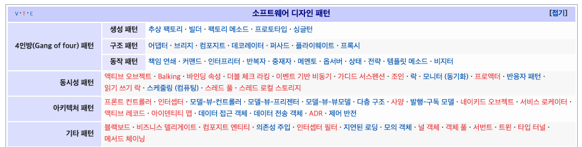
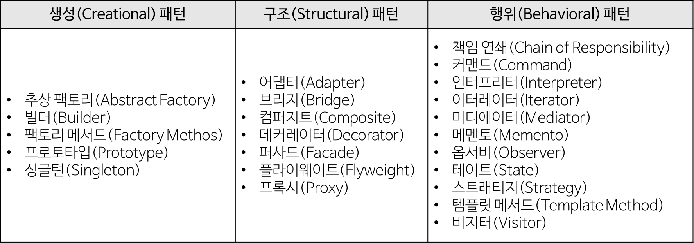

# 디자인 패턴의 개념과 종류

## 디자인 패턴의 개념

### 개요
- 소프트웨어 설계의 효율성을 높이는 최선의 해결책 중 하나
- 객체 생성과 코드 구조, 객체 간의 상호작용 등을 설계 단계에서 생각해야 한다.
- 유지보수 비용 감소, 코드 재사용성 증가 -> 쉽게 확장할 수 있는 구조의 프로젝트
- 재사용할 수 있는 모듈간 독립적인 프레임워크를 제공하는 일이 현대 소프트웨어 개발의 핵심

- "바퀴를 다시 발명하지 마라"
  - 이미 만들어져서 잘 되는 것을 처음부터 만들 필요가 없다는 것 (재사용)
- 소프트웨어 재사용성, 호환성, 유지 보수성 증가의 목적이 있다.

### 특징
- 디자인패턴은 특정한 구현에 대한 것이 아니라 아이디어 (틀, 템플릿) 이다.
- 특정 문맥에서 공통적으로 발생하는 문제에 대해 재사용 가능한 해결책

## 디자인 패턴의 종류

- 디자인 패턴은 크게 4개의 종류로 나눌 수 있다.
  - GoF 디자인 패턴
  - 동시성 패턴
  - 아키텍쳐 패턴
  - 기타 패턴
- 각각에 해당하는 패턴들의 일부는 위 사진에서 확인할 수 있다.

## GoF 디자인 패턴
- 에리히 감마, 리차드 헬름, 랄프 존슨, 존 블라시디스 (Gang of Four)
  - 디자인 패턴을 구체화하고 체계화한 사람들
  - 23가지의 디자인 패턴을 정리하고, 생성(Creational), 구조(Structural), 행위(Behavioral)로 구분

### 생성(Creational) 패턴
- 객체 생성에 관련
- 객체의 생성과 조합을 캡슐화해, 특정 객체가 생성되거나 변경되어도 프로그램 구조에 영향을 크게 받지 않도록 유연성 제공
- 싱글턴 등의 패턴이 속한다.

### 구조(Structural) 패턴
- 클래스나 객체를 조합해 더 큰 구조를 만드는 패턴
- 서로 다른 인터페이스를 지닌 2개 객체를 묶어 단일 인터페이스를 제공하거나, 객체들을 서로 묶어 새로운 기능을 제공하는 등의 패턴이 있다.
- 어댑터, 데커레이터 등의 패턴이 속한다.

### 행위(Behavioral) 패턴
- 객체나 클래스 사이의 알고리즘이나 책임 분배에 관련된 패턴
- 한 객체가 혼자 수행할 수 없는 작업을 여러 개의 객체로 어떻게 분배하는지, 그러면서도 객체 사이의 결합도를 최소화 하는 것에 중점을 둔다.
- 책임연쇄, 스트래티지 등의 패턴이 속한다.

## 동시성 패턴
- 멀티스레드 프로그래밍의 동시성을 위한 패턴
- 동시 실행의 경우 고려해야할 점들을 생각한 패턴이다.
- 스케쥴링, 락, 스레드 풀 등의 패턴이 있다.

## 아키텍처 패턴
- 소프트웨어 아키텍쳐에서 일반적으로 발생하는 문제점들에 대한 일반화되고 재사용 가능한 솔루션 (디자인 패턴보다 큰 범주)
- 대표적인 패턴
  - 계층화 (Layered)
  - 클라이언트-서버 (Client - Server)
  - 마스터-슬레이브 (Master - Slave)
  - 파이프 필터 (Pipe filter)
  - 브로커 (Broker)
  - 피어 투 피어 (Peer to peer)
  - 이벤트 버스 (Event - Bus)
  - MVC (Model - View - Controller)
  - 블랙보드 (Blackboard)
  - 인터프리터 (Interpreter)

## 참고
- [Seogeurim/CS-study](https://github.com/Seogeurim/CS-study/tree/main/contents/design-pattern)
- [JaeYeopHan/Interview_Question_for_beginner](https://github.com/JaeYeopHan/Interview_Question_for_Beginner/tree/master/DesignPattern)
- [WeareSoft/tech-interview](https://github.com/WeareSoft/tech-interview/blob/master/contents/designpattern.md)
- [10가지 소프트웨어 아키텍처 패턴 요약](https://mingrammer.com/translation-10-common-software-architectural-patterns-in-a-nutshell/)
- [아키텍처 패턴과 종류](https://the-boxer.tistory.com/26)
- [디자인 패턴 개요](https://younghk.github.io/software-engineering/2020-07-06---design-pattern-1/#concurrency-pattern%EB%8F%99%EC%8B%9C%EC%84%B1-%ED%8C%A8%ED%84%B4)