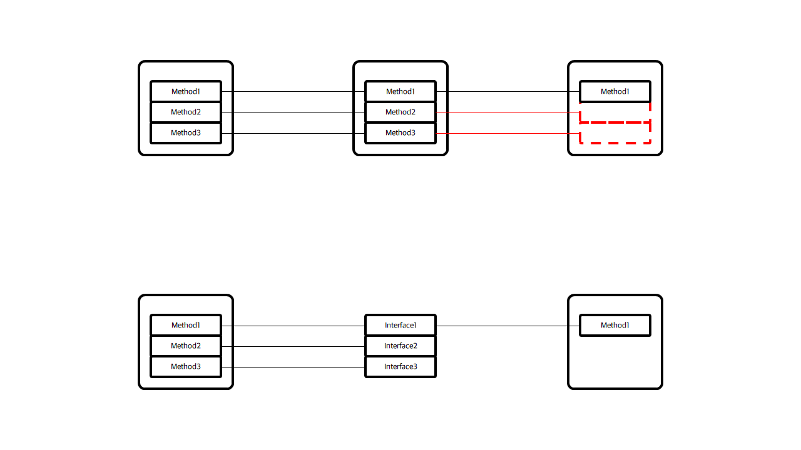
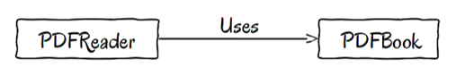
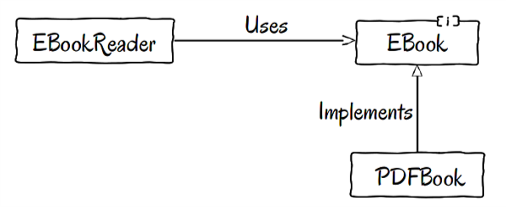

# SOLID Principles

## 객체지향 설계 5원칙이란?

> - 로버튼 C. 마틴(Robert C. Martin)이 객체 지향 프로그래밍 및 설계를 다섯 가지 기본 원칙으로 제시 한 것
> - 응집도(Cohesion)를 높인다.
> - 결합도(Coupling)는 낮춘다.

 

## 객체지향 설계 5원칙

- SRP(Single Responsibility Principle) : 단일 책임 원칙
- OCP(Open Closed Principle) : 개방 폐쇄 원칙
- LSP(Liskov Substitution Principle) : 리스코프 치환 원칙
- ISP(Interface Segregation Principle) : 인터페이스 분리 원칙
- DIP(Dependency Inversion Principle) : 의존 역전 원칙

    

## SRP(Single Responsibility Principle) - 단일 책임 원칙

---

소트프웨어의 구성요소(컴포넌트, 클래스, 모듈, 함수)에서 `확장은 개방적`으로, `수정은 폐쇄적`으로 대하는 원칙.

- 장점
  - 유연한 설계가 가능
  - 책임이 격리되어 연쇄적인 부작용 방지

가장 `기본적인 원칙`이지만 가장 직접 구현하기 `어려운` 원칙

  

## OCP(Open Closed Principle) - 개방 폐쇄 원칙

---

객체의 `확장은 개방적`으로, `수정은 폐쇄적`으로 대한다.

- 변경에 대한 비용은 줄인다.
- 확장에 대한 비용은 극대화한다.
- OCP를 통해 구조의 `의존도와 결합도를 낮출 수` 있다.

### 작동예시

- 요구사항 변경 발생 -> 기존 코드를 수정하는 대신 새 클래스를 만들어 붙이거나 상속 등을 통해 클래스 재사용 -변경(확장) 대상과 불변 대상을 명확히 구분 (클래스 나눔)
- 변경 대상과 불변 대상 사이에 인터페이스 정의
- 구상 클래스 대신 인터페이스를 통해 코드 작성

즉, `의존성을 인터페이스에 고정`시키고, 추가 클래스를 생성하여도 동작은 추가 되지만 기존의 코드는 수정되지 않게 하는 것이다.

  

## LSP(Liskov Substitution Principle) - 리스코프 치환 원칙

---

부모 객체와 자식 객체가 있을 때 자식 객체가 부모 객체를 `완전히 대체`할 수 있다.
자식 객체는 부모 객체의 특성을 가지며, 확장 가능하다. 하지만 과도한 확장은 잘못된 방향의 상속 객체를 가진다.

- 자식 객체는 부모 객체의 정의를 `위반`해서는 안된다.
- 구상 타입을 사용하지 말고 가능하다면 interface를 사용하여 프로그래밍 하라

- 적용 예시
  - 복수의 객체가 같은 일을 한다면 둘을 하나의 클래스로 묶고 이들을 구분할 수 있는 필드 생성 ex) 직사각형, 정사각형
  - 같은 연산을 약간씩 다르게 한다면 `공통 인터페이스`를 만들고 이를 구현 ex) 사각형, 원
  - 두 개체가 공통 연산 외에 약간의 차이를 가진다면, 상속을 통해 구현 ex) 가득 찬 원, 빈 원

즉, 자식 객체는 `부모 객체의 방향`을 온전히 따라간다.

  

## ISP(Interface Segregation Principle) - 인터페이스 분리 원칙

---

자신이 호출하지 않는 메소드 혹은 인터페이스에 의존하면 안된다.
무의미한 메소드의 `구현을 방지`하고, 반드시 `필요한 메소드만`을 구현한다.

- 자신이 사용하지 않을 인터페이스는 구현하지 않는다
- 응집도(Cohesion)에 영향을 준다
- 하나의 일반적인 인터페이스보다는, 여러 개의 `구체적인 인터페이스`가 낫다
- 가능하다면 SRP를 적용하라
- ISP를 적용할 때 상위 클래스는 풍성할 수록 좋고, 인터페이스는 작을수록 좋다

가능한 작은 인터페이스로 구분하여, 자식 객체에 상속한다.

  

## DIP(Dependency Inversion Principle) - 의존 역전 원칙

---

객체는 `저수준 모듈`보다 `고수준 모듈`에 의존해야 한다.

- 할리우드 원칙, Inversion of Control, Dependency Injection이라고도 함
- 객체가 객체에 의존하는 것이 아닌, 인터페이스에 의존해야 한다.

  
변경 전

  
변경 후

상위 클래스 혹은 인터페이스 일수록, 변하지 않을 가능성이 높다. 따라서 하위 클래스는 `상위 클래스 혹은 인터페이스를 통해 의존`해야 한다.

  

### 참고

- 응집도(Cohesion)
  - 결합도는 모듈(클래스)간의 상호 `의존` 정도
- 결합도(Coupling)
  - 하나의 모듈 내부에 존재하는 구성 요소들의 기능적 `관련성`
