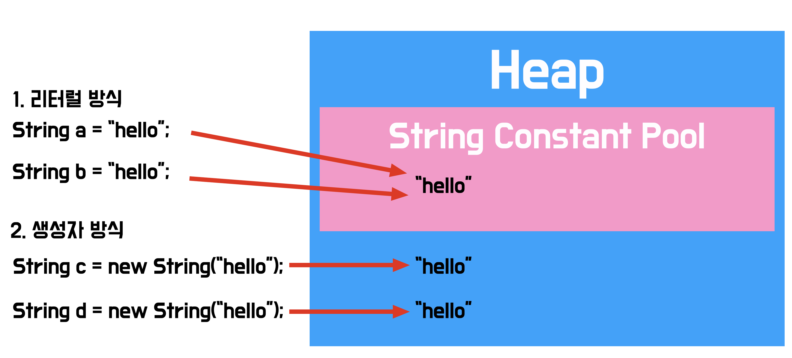
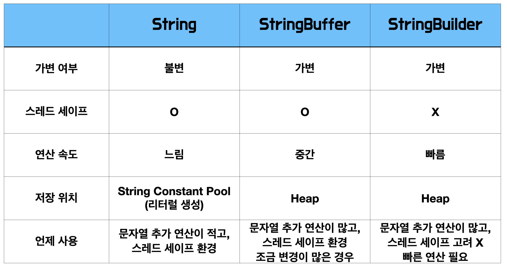

# String-StringBuilder-StringBuffer

> JAVA에서 `문자열`을 만드는 방법

<br><br>

## String

---

자바에서 문자열을 표현하는 가장 `기본적인` 방법.

- String Class는 사용 빈도가 매우 높다.
- 기본 타입처럼 `특수한 선언`이 가능하다.
- `Heap`영역에서 사용되는 참조형 클래스이다.
- String Class는 `immutable(불변)`한 객체이다.

  > Strings are constant; their values cannot be changed after they are created.(java docs)

- Thread Safe
  <br><br>

### String Class의 생성

---

#### 리터럴 방식

```
 String a = "hello";
 String b = "hello";

 System.out.println(a == b);
 System.out.println(a.equals(b));
```

- 출력값은?

```
 true
 true
```

<br>

#### 생성자 방식

```
 String a = new String("hello");
 String b = new String("hello");

 System.out.println(a == b);
 System.out.println(a.equals(b));
```

- 출력값은?

```
 false
 true
```

<br><br>

### String Class의 초기화와 해제

---

#### String Class의 초기화

- append(), + 등의 메소드 사용으로 String객체의 형태가 바뀐다면, 참조된 String객체의 내용이 바뀌는 것이 아니라 `새로운 객체`를 생성하여 해당 주소를 참조합니다.

<br>

#### String Class의 해제

- 참조되지 않는 주소값을 가진 String은 Garbage Collector에 의해 제거된다.
  - String Class의 성능 저하는 GC 의 빈번한 사용에서 온다!

<br>



### String Constant Pool

---

- String Class의 빈번한 사용으로 인해 만들어 짐
- 일종의 캐시와 비슷한 개념
- interm() method를 통해 constant pool에 String을 할당 할 수 있음
- Pool을 늘릴수록 성능저하가 발생함

<br><br>

## StringBuffer

---

String Class의 `immutable(불변)`의 특성을 보안하기 위해 고안된 클래스

- `mutable(가변)`한 객체
- Thread Synchronized
- Thread Safe

<br><br>

### StringBuffer Class의 생성

---

```
 StringBuffer a = new StringBuffer("hello");
```

- append(), + 등의 메소드 사용으로 String객체의 형태가 바뀐다면, `동일한 객체`의 주소를 참조합니다.
- 문자열 연산이 일어나면 `연속된 메모리`를 참조

<br><br>

## StringBuilder

---

String Class의 `immutable(불변)`의 특성을 보안하기 위해 고안된 클래스

- `mutable(가변)`한 객체
- Thread Safe와 Synchronized를 제공하지 않기 때문에 연산이 빠르다

<br><br>

### StringBuilder Class의 생성

---

```
 StringBuilder a = new StringBuilder("hello");
```

- append(), + 등의 메소드 사용으로 String객체의 형태가 바뀐다면, 동일한 객체의 주소를 참조합니다.
- 문자열 연산이 일어나면 `연속된 메모리`를 참조

<br><br>

## Thread Safe

---

- 멀티 스레드 프로그래밍에서 함수나 변수, 혹은 객체가 여러 스레드로부터 `동시에 접근`이 이루어져도 프로그램의 `실행`에 문제가 없는것

- Synchronized를 통해 구현

```
    Thread thread1 = new Thread(() ->{
                    try{
                        String result;
                        synchronized (unsafeDateFormat) {
                            result= unsafeDateFormat.format(date1);
                        }

                    }catch(Exception e){
                        e.printStackTrace();
                        break;
                    }
            });

```

- volatile, ReentrantLock, AtomicIntger를 통해 구현

<br><br>

## 비교 테이블

---



<br><br>

### 참고

- 불변이란?
  - 참조 주소의 값이 변하지 않음.
- 가변이란?
  - 참조 주소의 값이 변할 수 있음.

> ### 출처
>
> - https://docs.oracle.com/javase/8/docs/api/
> - https://velog.io/@skyepodium/%EC%9E%90%EB%B0%94-String-StringBuffer-StringBuilder-%EC%B0%A8%EC%9D%B4%EC%A0%90
