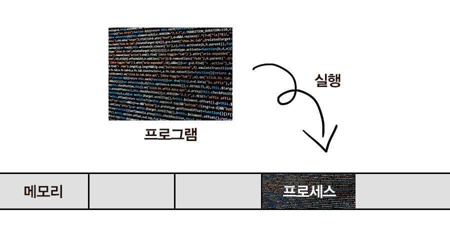

# 프로세스와 스레드

- 프로그램: 파일 단위로 저장 장치에 저장, 아직 실행되지 않은 코드 덩어리 (정적)
- 프로세스: 실행 중인 프로그램 (동적)
  - 프로그램 실행에 필요한 주소 공간, 파일, 메모리 등을 운영체제로부터 할당 받은 프로그램 = 프로세스
  - 프로그램이 프로세스가 되려면:
    - 코드, 데이터, 힙, 스택 영역에 메모리에 적재
    - PCB가 생성됨

- 스레드: 프로세스의 실행 단위. 같은 프로세스 내에 있는 스레드들은 프로세스의 자원을 공유
  - 프로세스가 할당 받은 자원을 이용하는 실행 흐름의 단위

## 프로세스
- 운영체제로부터 메모리 공간을 할당 받아 실행 중인 프로그램
  
  ### 프로세스에 할당되는 메모리 영역
  
  - `코드 (Code)`, `데이터 (Data)`, `힙 (Heap)`, `스택 (Stack)` 영역 
  - 코드 영역: 프로세스가 실행할 코드가 기계어의 형태로 저장된 공간 (컴파일 타임에 결정, Read-Only)
  - 데이터 영역: 전역 변수, static 변수 등이 저장된 공간. 전역 변수, static 변수를 참조한 코드는 컴파일 후 데이터 영역의 주소값을 가르킴 (컴파일 타임에 결정, Read-Write: 실행 도중 변경 가능)
  - 힙 영역: 프로그래머가 관리하는 메모리 영역. 힙 영역에 메모리를 할당하는 것을 동적 할당이라고 한다. (런타임에 결정, 스택보다 할당할 수 있는 메모리 공간이 많으나, 데이터 읽고 쓰기가 느림)
  - 스택 영역: 함수 안에서 선언된 지역변수, 매개변수, 리턴값, 복귀 주소 등이 저장됨. 스택의 LIFO 방식에 따라 함수 호출 시 기록하고 종료되면 제거 (컴파일 타임에 결정, 정해진 크기가 있으므로 stack overflow 에러 발생 가능)
  
  ### 프로세스 제어 블록 (Process Control Block, PCB)
  - 특정 프로세스에 대한 정보를 담고 있는 운영체제의 자료구조
  1. 프로세스는 운영체제의 스케줄링 알고리즘에 따라 CPU를 할당 받는다.
  2. 작업을 진행하다가 프로세스 전환이 발생하면 하던 일을 저장하고 CPU를 반환해야 한다.
  3. 나중에 스케줄링에 의해 재실행 되었을 때, 이전에 어디까지 작업이 진행되었는지 정보를 알아야 한다.
  4. 그것에 대한 정보가 담긴 공간이 PCB 이다.
  - 프로세스 생성과 동시에 그 프로세스의 고유한 PCB도 함께 생성된다.

    #### PCB에 저장되는 정보
    
    - 프로세스 식별자 (Process ID, PID)
    - 프로세스 상태 (Process state) : new, ready, running, waiting, terminated
    - 프로그램 카운터 (Program counter) : 프로세스가 다음에 실행할 명령어의 주소를 가리킴
    - CPU 레지스터 : Accumulator, Index Register, 범용 레지스터 등
    - CPU 스케줄링 정보 : 프로세스 우선순위, 최종 실행 시각, CPU 점유 시간 등
    - 메모리 관리 정보 : Page table, Segment table 등
    - 계정 정보 : CPU 사용 시간, 제한 시간, 계정 번호 등
    - 입출력 상태 정보 : 프로세스에 할당된 입출력 장치, 개방된 파일 목록 등

## 스레드
- 경량화된 프로세스
- 프로세스를 구성하는 독립적인 실행 단위
- 같은 프로세스 내 다른 스레드와 메모리 영역을 공유할 수 있음
- 스택을 제외한 공유한 자원이 있기 때문에 컨텍스트 스위칭에 있어 캐시 적중률이 높음
  - 프로세스에 할당되는 4가지 메모리 영역 중 스택을 제외한 나머지 영역을 공유한다.
  - 간단하게 비교하자면, 회의실을 번갈아가며 쓸 때, TV를 두고 나가느냐 가지고 나가느냐의 차이로 비교할 수 있다.

- 스레드도 하나의 실행 흐름: 실행과 관련한 데이터가 필요
  - 독립적: 각 스레드는 자신만의 `고유한 스레드 ID`, `프로그램 카운터`, `레지스터 집합`, `스택 영역`을 가짐
  - 공유: 스레드가 속한 프로세스내의 `코드`, `데이터`, `힙` 영역과 `기타 운영체제 자원` (열린 파일, 신호 등)을 다른 스레드와 공유
- 각 스레드는 스택 영역을 통해 독립적인 실행 흐름을 가짐
- 스레드는 프로세스의 메모리 영역을 공유하기 때문에, 어떤 스레드 하나에서 오류가 발생하면, 같은 프로세스 내의 다른 스레드 모두가 강제로 종료됨
  - 프로세스는 한 프로세스가 강제 종료되어도, 공유 자원을 손상시키는 경우가 아니라면 다른 프로세스에 영향을 주지 않음

## 질문
- 프로그램과 프로세스의 차이는 무엇인가?
- 프로세스에 할당되는 메모리 영역 4가지
- 프로세스에 할당되는 4가지 메모리 영역 중, 각 스레드가 공유해서 사용하는 영역 3가지

## 출처
### 사진 출처
- [프로세스와 스레드의 차이](https://velog.io/@raejoonee/%ED%94%84%EB%A1%9C%EC%84%B8%EC%8A%A4%EC%99%80-%EC%8A%A4%EB%A0%88%EB%93%9C%EC%9D%98-%EC%B0%A8%EC%9D%B4)
- [OS 프로세스와 스레드의 차이](https://gmlwjd9405.github.io/2018/09/14/process-vs-thread.html)

### 레퍼런스
- [Process, Thread 차이가 뭐예요?](https://brunch.co.kr/@babosamo/100)